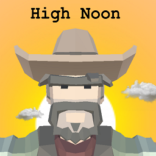

# HighNoon
My first ever game, written in C# and in Unity. 

High Noon was written for a game design class, and features realistic 3D graphics, an old wild-wild-west theme, and the ability to jump.
It is a simple game used to show how much I learned in my course, and is not meant to reflect what a full project will be, as this project was made in a short 3 months.
Anywho, I hope you enjoy, please use the arrow keys to walk, and "space" to shoot, when prompted.

Yee Haw!

